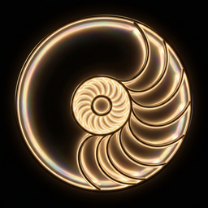

# Artosphere (ARTS)

**The first cryptocurrency backed by peer-verifiable physics.**

## Token Info

| Parameter | Value |
|-----------|-------|
| **Name** | Artosphere |
| **Symbol** | ARTS |
| **Chain** | Base (Chain ID: 8453) |
| **Contract** | `0x54E9D42A9c9A0Cb853Ed41C152d29e180eEd1D94` |
| **Max Supply** | 987,000,000 (F(16) × 10⁶) |
| **Decimals** | 18 |

## Deployed Contracts (Base Mainnet)

| Contract | Address |
|----------|---------|
| ARTS Token | `0x54E9D42A9c9A0Cb853Ed41C152d29e180eEd1D94` |
| FibonacciFusion | `0x01A042e101eCE5872bCAe66B8E4B115044616277` |
| Discovery NFT | `0x5a6513f70f29BCc3Bd82f7AeC66bF99671D1DBdD` |
| PhiStaking | `0x5ba76643E3ef93Ab76Efc8e162594405A3c79f7B` |
| ZeckendorfTreasury | `0x3858A36a06c946aF0Df4814E02135FBDe59f0255` |
| ArtosphereQuests | `0xC569d3cf116d927204a29Ace57dBc397270386Ec` |
| PhiVesting | `0xB2B3a5f8cd8E3C1fC60d9179737C007672C0B4F9` |

## Science

Every parameter traces to φ = (1+√5)/2 and Cl(9,1):

- **Supply 987M** = F(16), the Fibonacci unification number
- **Burn rate 38.2%** = 1/φ² (Fibonacci fusion τ⊗τ = 1⊕τ)
- **Fee 1.18%** = αₛ (strong coupling constant)
- **Quorum 30.9%** = sin²θ₁₂ (confirmed by JUNO at 0.02σ)

**Zenodo DOI:** [10.5281/zenodo.19471249](https://doi.org/10.5281/zenodo.19471249)

## License

MIT
